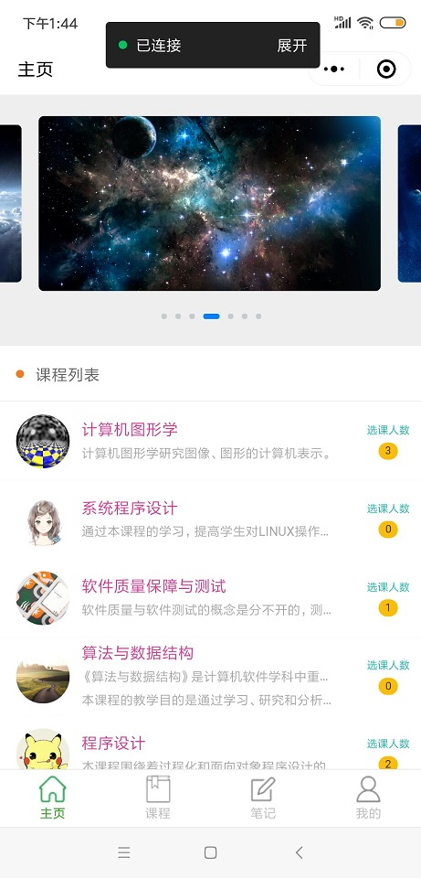
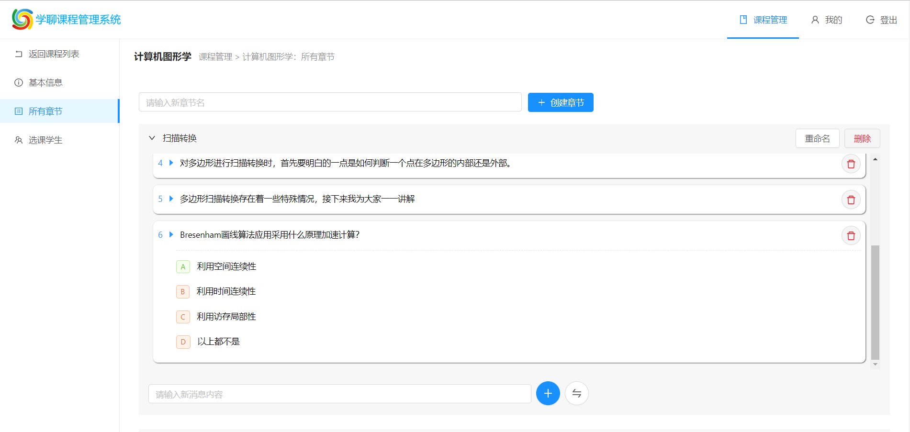
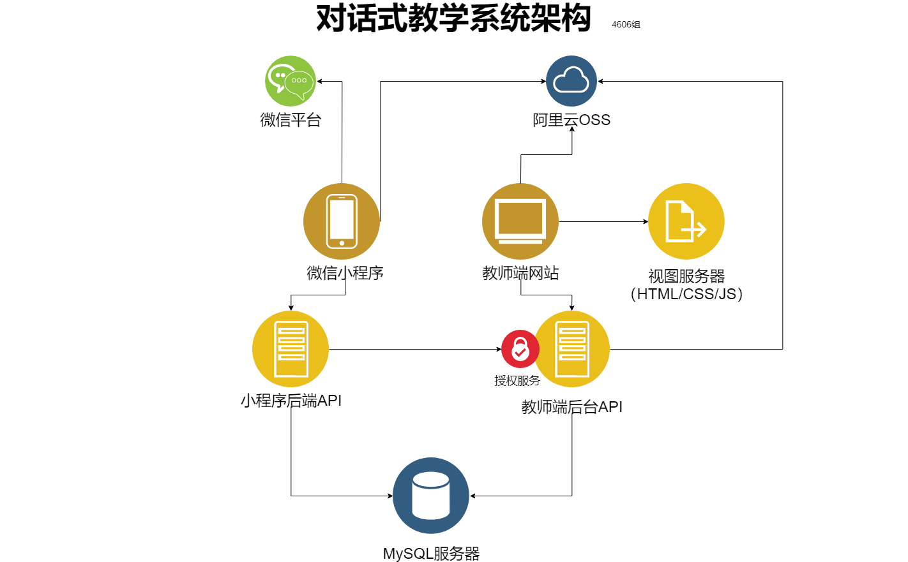
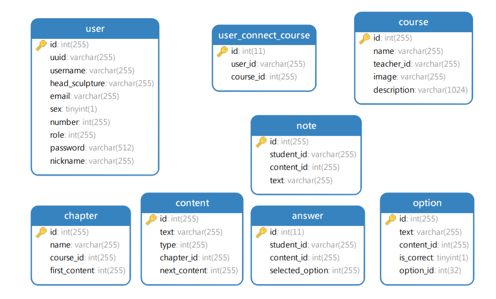

## 1. 简介

本项目是复旦大学2019年《高级Web技术》课程项目 : 基于微信小程序的教学内容管理平台，由王萌、魏入磊、刘辉、朱小宁共同开发，实现了一个微信小程序（学生）和PC端网页（教师）双端的对话式教学系统。

本项目由4个子项目组成，它们的Github仓库地址如下：

* 微信小程序：https://github.com/XHHuiL/ConversationalEducation
* 微信小程序后端：https://github.com/XHHuiL/ConversationalEducationServer
* 教师端Web应用前端：https://github.com/zzxn/conversation-teaching-background
* 教师端Web应用后端：https://github.com/zzxn/adweb-user-rest

### 微信小程序界面



### 教师端界面





## 2. 操作说明

* [微信小程序操作说明](微信小程序的操作说明.md "微信小程序操作说明")
* [教师Web应用操作说明](对话式教学系统教师端操作说明.md "微信小程序操作说明")


## 3. 项目整体架构

### 架构概览



* 本系统使用了完全的前后端分离架构
* 有两类前端：微信小程序和教师端网站（```Angular```实现）
* 有两个API略有重叠的后端```REST-like```服务，均采用```Spring Boot```实现
* 阿里云OSS提供对象存储服务

### 架构详细说明

* 微信小程序向自己实现的后端API请求/传送数据，向```阿里云OSS```请求图片资源
* 小程序后端API使用```Spring Boot```实现，向```MySQL```服务器请求数据，向教师端后台API的授权服务请求Token（第一次登录时注册信息）
* 教师端网站向视图服务器请求```Angular```应用（```HTML/CSS/JS```），之后向教师端后台API请求/传送数据，向```阿里云OSS```请求图片资源
* 教师端后端API使用```Spring Boot```实现，向```MySQL```服务器请求数据，往```阿里云OSS```上传图片资源
* 视图服务器只提供```HTML/CSS/JS```，不组装页面，不进行路由
* ```MySQL```服务器由两个后端API共享，实现数据互通
* ```阿里云OSS```保存和提供图片资源

### 数据库表结构




## 4. 功能点说明

功能项 | 得分项 |	实现情况
- | - | -
基本功能	 | 小程序端页面功能 | 学生可以修改个人信息、能够查看并参与课程<br>支持对话式学习并能保存学习进度<br>能够添加笔记、编辑笔记、删除笔记。
&nbsp; | 教师后台页面功能 | 课程的内容按照对话式教学的方式、教师发布课程；<br>将课程的内容按照章节编排、教师查看学生的选课，<br>作业完成率以及作业完成度；实现了注册、登录、登出。
课程内容编排 | 教师和学员之间的文本对话 | 支持文本对话聊天室，能够以消息气泡的形式显示头像和内容，老师名字显示在page的最上方。
&nbsp; | 场景的创意、功能的完成度和交互的丰富程度 | 学生可以在聊天室请求章节内容，如果请求到一个问题，那么需要对问题进行回答，老师会对学生的回答给出反馈。<br>老师也会对学生的不正确操作给出反馈。
&nbsp; | 对话框内可以创建选择题，学生完成选择题，教师查看题目完成情况 | 教师Web应用可以创建选择题，学生在微信端完成选择题后，教师可以在Web应用上查看学生的进度和正确率。
&nbsp; | 在浏览器端正常保存、编辑，在小程序端正常渲染 | √
&nbsp; | 学生对于课程内容的收藏、笔记等功能 | 学生可以在微信端首页浏览所有的课程，然后可以选择课程，<br>进入课程后，可以对章节内容添加笔记。
工程能力	| 文档 | √
&nbsp; | 系统架构 | √
&nbsp; | 代码风格| 良好
&nbsp; | 项目完整度和易用性 | 项目完整，容易使用。
附加功能	| 模型、动画、场景的美观程度	| 微信端首页最上方轮播图片、微信端我的页面使用gif、教师Web应用课程管理页面使用了渐变色。微信端使用了ColorUI CSS库，教师端使用NG ZORRO组件库进行美化。
&nbsp; | 使用 Docker 部署服务器	 | 将微信小程序后端、教师Web应用教师Web应用后端、mysql数据库均部署到了相应的docker容器中。
&nbsp; |将服务器部署到公有云上 |	服务器部署到了公有云上，入口地址 http://139.196.215.77
&nbsp; | 其他合理的附加功能 |	使用阿里云的对象存储服务来存储用户的头像和课程的图片，使用token对用户进行认证和授权（实现细节见附加功能部分）。

## 5. 附加功能及其实现原理

## 6. 团队分工

团队成员 | 分工 | 具体完成的工作 | 总体贡献比例
- | - | - | -
刘辉 | 微信小程序开发、微信小程序后端开发 | 开发微信小程序；开发微信小程序后端；部署微信小程序后端；部署MySQL数据库；设计数据库表；编写项目文档；编写微信小程序的操作说明。 | 30%
魏入磊 | 微信小程序开发、教师Web应用后端 | 协助开发微信小程序聊天室；协助开发教师Web应用后端；协助美化微信小程序；协助设计数据库表；编写和导入课程内容；测试教师Web应用和微信小程序。 | 20%
朱小宁 | 教师Web应用、教师Web应用后端 | 开发教师Web应用；开发教师Web应用后端；协助设计数据库表；协助设计LOGO；实现Token验证及授权；注册使用阿里云对象存储服务；部署教师Web应用；部署教师Web应用后端；编写项目文档；编写教师Web应用的操作说明。 | 30%
王萌 | 教师Web应用 | 协助设计数据库表，协助开发教师Web应用；设计LOGO；协助美化教师Web应用；编写和导入课程内容；测试教师Web应用和微信小程序。  | 20%

