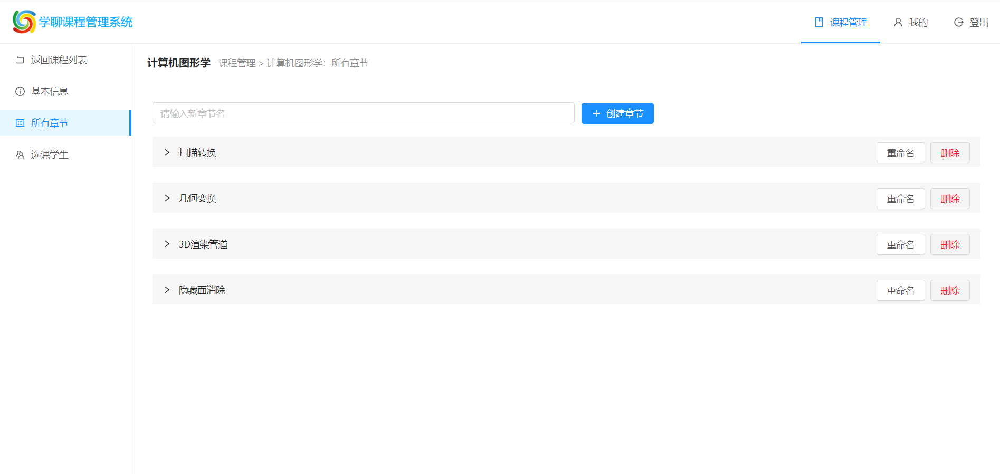

# 对话式教学系统教师端用法说明

by 朱小宁 16307110325

对话式教学系统教师端部署地址：http://139.196.215.77
下面通过演示教师端操作基本流程的方式说明用法：

## 1 登录/注册

## 2 登录后查看课程

## 3 在左上角处可以创建课程

## 4 点击卡片进入课程，查看/编辑课程信息

## 5 点击右侧【所有章节】，查看/创建/修改/删除各个章节

## 6 点击展开章节，在这里查看/创建/删除章节中的内容

## 7 创建文本消息和问题

### 文本消息

### 问题消息

## 8 点击右侧【选课学生】，在这里查看选课学生信息

## 9 点击右上角【我的】，维护个人信息

## 10 点击右上角【登出】来退出系统

注：如果不手动登出，Token会在两小时后生效，届时会弹出提示，且无法加载任何信息。

